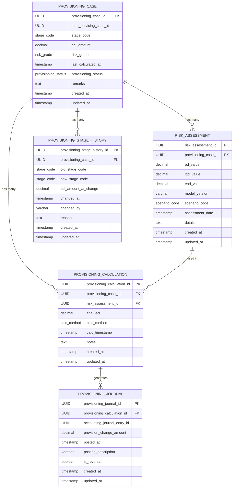

# Core Lending Provisioning Risk Service

[](https://opensource.org/licenses/Apache-2.0)
[](https://openjdk.java.net/projects/jdk/21/)
[](https://spring.io/projects/spring-boot)

## Overview

The **Core Lending Provisioning Risk Service** is a critical microservice component of the **Firefly OpenCore Banking Platform**, developed by **Firefly Software Solutions Inc**. This service manages loan provisioning and risk assessment operations, providing comprehensive functionality for calculating Expected Credit Loss (ECL) amounts, managing provisioning cases, and tracking risk assessments for loan portfolios in compliance with IFRS 9 standards.

The service implements a sophisticated risk assessment framework that supports multiple calculation methods, scenario-based modeling, and comprehensive audit trails for regulatory compliance and financial reporting.

## Key Features

- **IFRS 9 Compliant ECL Calculations**: Support for 12-month ECL, lifetime ECL, and expert override methods
- **Multi-Stage Risk Assessment**: Implements IFRS 9 staging (Stage 1, 2, 3, and POCI)
- **Scenario-Based Modeling**: Support for Base, Optimistic, Adverse, and Severe scenarios
- **Comprehensive Risk Grading**: AAA to D risk grade classification system
- **Audit Trail**: Complete history tracking of stage changes and calculations
- **Journal Integration**: Seamless integration with accounting systems for provision posting
- **Reactive Architecture**: Built on Spring WebFlux for high-performance, non-blocking operations

## Architecture

### Module Structure

The service follows a clean, modular architecture with clear separation of concerns:

1. **core-lending-provisioning-risk-interfaces**
   - DTOs, enums, and interfaces defining the API contract
   - Public interfaces for external service integration
   - Validation annotations and constraints

2. **core-lending-provisioning-risk-models**
   - Database entities and repository interfaces
   - R2DBC-based reactive data access layer
   - Database migration scripts (Flyway)

3. **core-lending-provisioning-risk-core**
   - Business logic and service implementations
   - Domain services and calculation engines
   - Entity-DTO mapping with MapStruct

4. **core-lending-provisioning-risk-web**
   - REST controllers and web configuration
   - OpenAPI documentation and Swagger UI
   - Request/response handling and validation

5. **core-lending-provisioning-risk-sdk**
   - Client SDK for external service integration
   - OpenAPI specification and generated clients

### Technology Stack

- **Java 21** with Virtual Threads for enhanced concurrency
- **Spring Boot 3.x** with Spring WebFlux for reactive programming
- **R2DBC** for reactive database access with PostgreSQL
- **Flyway** for database schema migrations
- **OpenAPI 3.0** with Swagger UI for API documentation
- **Maven** for dependency management and build automation
- **Lombok** for reducing boilerplate code
- **MapStruct** for type-safe bean mapping
- **Micrometer** with Prometheus for metrics and monitoring

## Data Model

The service manages five core entities with well-defined relationships:

### Entity Relationship Diagram



### Enumerations

- **Stage Code**: `STAGE_1`, `STAGE_2`, `STAGE_3`, `POCI`
- **Risk Grade**: `AAA`, `AA`, `A`, `BBB`, `BB`, `B`, `CCC`, `CC`, `C`, `D`
- **Provisioning Status**: `ACTIVE`, `RELEASED`, `WRITTEN_OFF`, `RECOVERED`
- **Scenario Code**: `BASE`, `OPTIMISTIC`, `ADVERSE`, `SEVERE`
- **Calculation Method**: `TWELVE_MONTH_ECL`, `LIFETIME_ECL`, `EXPERT_OVERRIDE`

## API Documentation

### REST Endpoints

The service provides a comprehensive RESTful API with the following endpoint structure:

#### Provisioning Cases
- `GET /api/v1/provisioning-cases` - List and search provisioning cases
- `POST /api/v1/provisioning-cases` - Create a new provisioning case
- `GET /api/v1/provisioning-cases/{id}` - Retrieve a specific provisioning case
- `PUT /api/v1/provisioning-cases/{id}` - Update a provisioning case
- `DELETE /api/v1/provisioning-cases/{id}` - Delete a provisioning case

#### Risk Assessments (Nested under Provisioning Cases)
- `GET /api/v1/provisioning-cases/{caseId}/risk-assessments` - List risk assessments
- `POST /api/v1/provisioning-cases/{caseId}/risk-assessments` - Create risk assessment
- `GET /api/v1/provisioning-cases/{caseId}/risk-assessments/{id}` - Get risk assessment
- `PUT /api/v1/provisioning-cases/{caseId}/risk-assessments/{id}` - Update risk assessment
- `DELETE /api/v1/provisioning-cases/{caseId}/risk-assessments/{id}` - Delete risk assessment

#### Provisioning Calculations (Nested under Provisioning Cases)
- `GET /api/v1/provisioning-cases/{caseId}/calculations` - List calculations
- `POST /api/v1/provisioning-cases/{caseId}/calculations` - Create calculation
- `GET /api/v1/provisioning-cases/{caseId}/calculations/{id}` - Get calculation
- `PUT /api/v1/provisioning-cases/{caseId}/calculations/{id}` - Update calculation
- `DELETE /api/v1/provisioning-cases/{caseId}/calculations/{id}` - Delete calculation

#### Stage History (Nested under Provisioning Cases)
- `GET /api/v1/provisioning-cases/{caseId}/stage-history` - List stage changes
- `POST /api/v1/provisioning-cases/{caseId}/stage-history` - Record stage change
- `GET /api/v1/provisioning-cases/{caseId}/stage-history/{id}` - Get stage change
- `PUT /api/v1/provisioning-cases/{caseId}/stage-history/{id}` - Update stage change
- `DELETE /api/v1/provisioning-cases/{caseId}/stage-history/{id}` - Delete stage change

#### Provisioning Journal (Nested under Calculations)
- `GET /api/v1/provisioning-cases/{caseId}/calculations/{calcId}/journal` - List journal entries
- `POST /api/v1/provisioning-cases/{caseId}/calculations/{calcId}/journal` - Create journal entry
- `GET /api/v1/provisioning-cases/{caseId}/calculations/{calcId}/journal/{id}` - Get journal entry
- `PUT /api/v1/provisioning-cases/{caseId}/calculations/{calcId}/journal/{id}` - Update journal entry
- `DELETE /api/v1/provisioning-cases/{caseId}/calculations/{calcId}/journal/{id}` - Delete journal entry

### Interactive Documentation

When the application is running, access the interactive API documentation:

- **Swagger UI**: `http://localhost:8080/swagger-ui.html`
- **OpenAPI Spec**: `http://localhost:8080/v3/api-docs`

## Setup and Installation

### Prerequisites

- **Java 21** or later (with Virtual Threads support)
- **Maven 3.8** or later
- **PostgreSQL 12** or later
- **Docker** (optional, for containerized deployment)

### Environment Variables

Configure the following environment variables:

```bash
# Database Configuration
DB_HOST=localhost
DB_PORT=5432
DB_NAME=provisioning_risk
DB_USERNAME=postgres
DB_PASSWORD=postgres
DB_SSL_MODE=disable

# Server Configuration (Optional)
SERVER_ADDRESS=localhost
SERVER_PORT=8080
```

### Building the Application

```bash
# Clone the repository
git clone https://github.com/firefly-oss/core-lending-provisioning-risk.git
cd core-lending-provisioning-risk

# Build with Maven
mvn clean package

# Run tests
mvn test
```

### Running Locally

```bash
# Run with Maven (recommended for development)
mvn spring-boot:run -pl core-lending-provisioning-risk-web

# Or run the JAR directly
java -jar core-lending-provisioning-risk-web/target/core-lending-provisioning-risk.jar
```

### Database Setup

The application uses Flyway for automatic database migration. Ensure PostgreSQL is running and the database exists:

```sql
CREATE DATABASE provisioning_risk;
```

The application will automatically create the required tables and enums on startup.

## Configuration

### Application Profiles

The service supports multiple Spring profiles for different environments:

- **dev**: Development environment with debug logging and detailed error messages
- **testing**: Testing environment with API documentation enabled
- **prod**: Production environment with optimized logging and security settings

### Configuration Properties

Key configuration properties in `application.yaml`:

```yaml
spring:
  application:
    name: core-lending-provisioning-risk
    version: 1.0.0
    description: Provisioning Risk Core Application
    team:
      name: Firefly Software Solutions Inc
      email: dev@getfirefly.io

  r2dbc:
    pool:
      initial-size: 5
      max-size: 10
      max-idle-time: 30m
      validation-query: SELECT 1

  threads:
    virtual:
      enabled: true  # Enable Java 21 Virtual Threads

management:
  endpoints:
    web:
      exposure:
        include: health,info,prometheus
  endpoint:
    health:
      show-details: always
      probes:
        enabled: true
```

## Development Guidelines

### Code Standards

- **Java 21 Features**: Leverage Virtual Threads, pattern matching, and modern language features
- **Reactive Programming**: Use Mono/Flux consistently throughout the application
- **Lombok**: Minimize boilerplate with `@Data`, `@Builder`, `@RequiredArgsConstructor`
- **Validation**: Use Bean Validation annotations on DTOs
- **Error Handling**: Implement proper error handling with meaningful error messages

### Testing Strategy

```bash
# Run all tests
mvn test

# Run integration tests
mvn test -Dtest="*IT"

# Run with specific profile
mvn test -Dspring.profiles.active=testing
```

**Testing Guidelines:**
- Write unit tests for service implementations using `@ExtendWith(MockitoExtension.class)`
- Write integration tests for repositories using `@DataR2dbcTest`
- Write web layer tests for controllers using `@WebFluxTest`
- Use `StepVerifier` for testing reactive streams
- Maintain minimum 80% code coverage

### Git Workflow

- **main**: Production-ready code, protected branch
- **develop**: Integration branch for features
- **feature/***: Feature development branches
- **hotfix/***: Critical production fixes

```bash
# Feature development workflow
git checkout develop
git pull origin develop
git checkout -b feature/new-feature
# ... make changes ...
git commit -m "feat: add new feature"
git push origin feature/new-feature
# Create pull request to develop
```

## Deployment

### Container Deployment

The service is designed for containerized deployment. While no Dockerfile is currently present in the repository, the application can be containerized using standard Spring Boot practices:

```dockerfile
FROM openjdk:21-jdk-slim
COPY core-lending-provisioning-risk-web/target/core-lending-provisioning-risk.jar app.jar
EXPOSE 8080
ENTRYPOINT ["java", "-jar", "/app.jar"]
```

### Environment-Specific Deployments

- **Development**: `http://core.catalis.vc/loan-origination`
- **Local Development**: `http://localhost:8080`

### Health Checks and Monitoring

The service exposes comprehensive monitoring endpoints:

- **Health Check**: `GET /actuator/health`
  - Database connectivity
  - Application status
  - Custom health indicators

- **Application Info**: `GET /actuator/info`
  - Build information
  - Git commit details
  - Application metadata

- **Metrics**: `GET /actuator/prometheus`
  - JVM metrics
  - HTTP request metrics
  - Custom business metrics
  - Database connection pool metrics

### Performance Considerations

- **Virtual Threads**: Enabled for improved concurrency handling
- **Connection Pooling**: R2DBC connection pool configured for optimal performance
- **Reactive Streams**: Non-blocking I/O throughout the application stack
- **Database Indexing**: Proper indexing on frequently queried columns

## Integration

### External Dependencies

The service integrates with:

- **Loan Servicing System**: Via `loan_servicing_case_id` reference
- **Accounting System**: Via `accounting_journal_entry_id` for journal entries
- **Common Libraries**: Firefly common web and validation libraries

### SDK Usage

The service provides an SDK module for easy integration:

```xml
<dependency>
    <groupId>com.firefly</groupId>
    <artifactId>core-lending-provisioning-risk-sdk</artifactId>
    <version>1.0.0-SNAPSHOT</version>
</dependency>
```

## Contributing

We welcome contributions to the Firefly OpenCore Banking Platform! Please follow these guidelines:

1. **Fork** the repository
2. **Create** a feature branch from `develop`
3. **Make** your changes with appropriate tests
4. **Ensure** all tests pass and code coverage is maintained
5. **Submit** a pull request with a clear description

### Code Review Process

- All changes require peer review
- Automated tests must pass
- Code coverage must not decrease
- Documentation must be updated for API changes

## License

This project is licensed under the **Apache License 2.0** - see the [LICENSE](LICENSE) file for details.

## Support and Contact

- **Organization**: [Firefly Software Solutions Inc](https://getfirefly.io)
- **GitHub Organization**: [firefly-oss](https://github.com/firefly-oss)
- **Development Team**: dev@getfirefly.io
- **Documentation**: Available in the `/docs` directory and via Swagger UI

## Related Projects

This service is part of the larger Firefly OpenCore Banking Platform ecosystem:

- **Core Loan Origination**: Loan application and approval workflows
- **Core Account Management**: Customer account lifecycle management
- **Core Payment Processing**: Payment and transaction processing
- **Core Risk Management**: Comprehensive risk assessment and monitoring

---

**Firefly OpenCore Banking Platform** - Building the future of open banking infrastructure.
